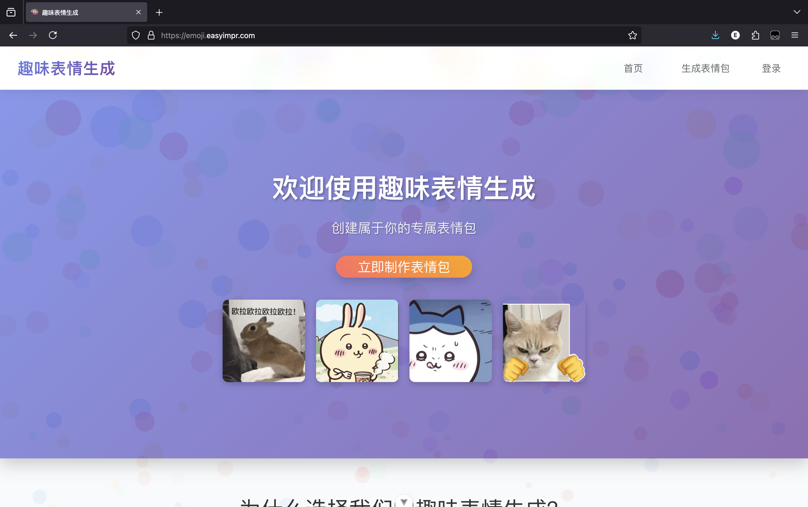
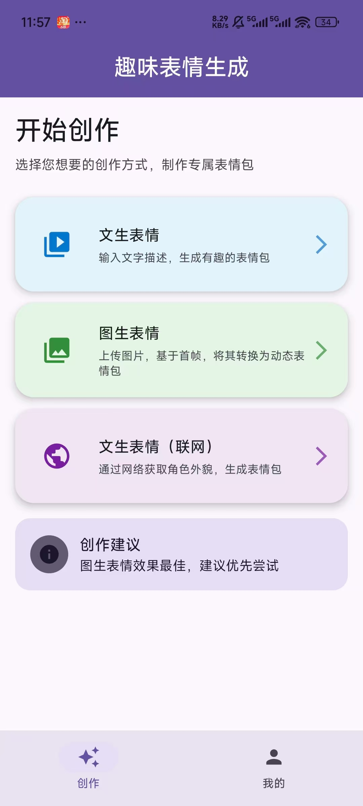
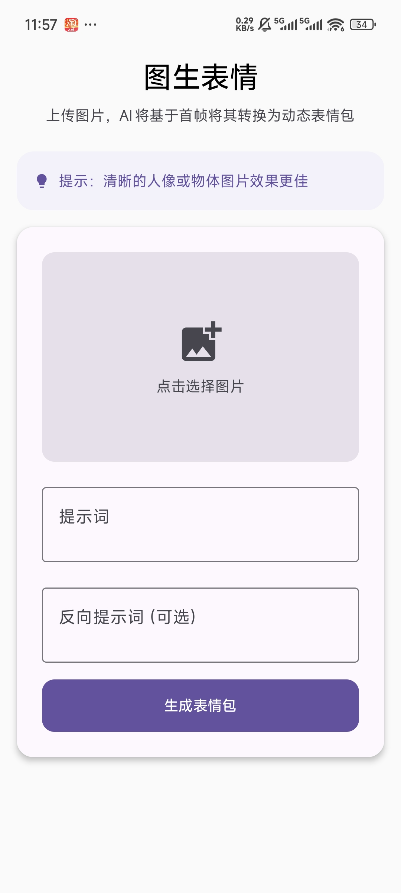
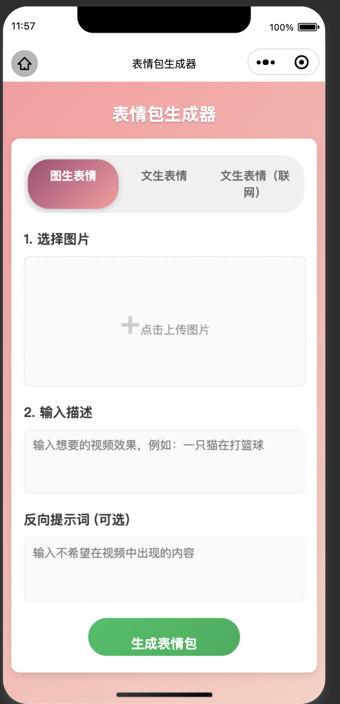
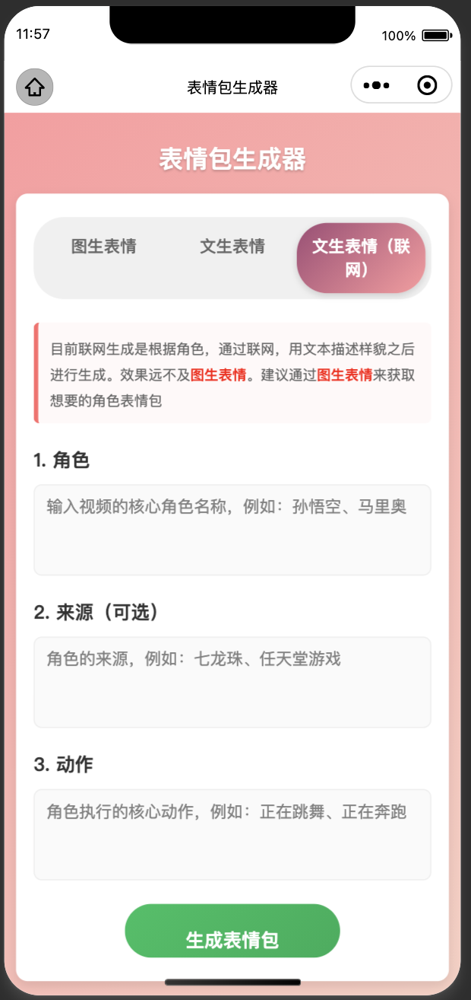

# AI 表情包生成器 (Meme Maker)

## 📌 项目简介
**AI 表情包生成器** 是一个支持 **网页端 & 安卓 App & 微信小程序** 的智能应用。  
它结合多模态 AI 技术，支持三大核心功能：  

1. **文生图 (Text-to-Image)**：用户输入一段描述文字，AI 自动生成符合描述的图片/表情。

    小猫打篮球 -->  

2. **图生图 (Image-to-Image)**：用户上传一张参考图和文字要求，AI 根据用户需求生成新的动态表情包。  

     --> 开始睡觉 --> 

3. **角色生表情包 (Character Meme Generator)**：用户指定角色名称,角色来源,执行动作，系统为角色生成一系列风格化动图表情。  
   
   角色：皮卡丘 来源：宝可梦 动作：开始跳舞 --> 

---

## ✨ 功能亮点
- 📝 **文生图**：输入“小猫打篮球”，即可生成相关图片/动图。  
- 📷 **图生图**：上传一张参考图（如人物头像）和文字要求，快速生成风格化表情包。  
- 🎭 **角色表情包**：自定义角色 → 批量生成动态表情。  
- 🎨 **个性化定制**：支持文字输入（表情文字/对白）、风格描述（搞笑/可爱/沙雕等）。  
- 📂 **结果下载与分享**：生成结果支持。  
- 🌐 **多端使用**：网页版 + 安卓APP +微信小程序。  

---

## ☠️ 缺点与不足

**1.微信小程序不够完善，只完成了基础页面以及登陆与注册的接口调用**

**2.微信小程序无法完成上线，由于有关AI生成的部分备案需要营业执照**

**3.角色生表情图是利用qween文本生成的插件实现联网生成的，效果不如自己调用维基百科等接口实现联网效果优，后续会优化**

---

## 🚀 部署与运行指南

**1.访问方式**

- **在线网站**：
   👉 https://emoji.easyimpr.com/
- **App 安装包下载**：下载安卓安装包使用。
- **微信小程序**: 目前无法上线，微信小程序还待完善，需要手动编译微信小程序使用。

**2.部署方法**

-**后端**：首先进入backend 新建`config.yaml`文件，输入
```
ai:
  key: "阿里云百炼的key"
jwt:
  secret: "secret_use_for_jwt"
server:
  port: "具体值"ˆ
  host: "具体值"
```
运行```go run .```

-**web前端**： 进入VCCG文件夹

安装依赖

```bash
npm install
```

开发环境运行

```bash
npm run dev
```
-**安卓APP**:打开`Android studio`打开`emojiMakeApp`文件夹build

-**微信小程序**:目前小程序中只完成了页面的构建以及登陆与注册的接口调用。打开微信开发者工具，导入`emojiMakeMiniApp`，之后编译

---

## 🐵 页面展示

### web



### 安卓



### 小程序



---

## 🙌 团队与贡献

本项目由 **灵码这一块/团队** 开发，欢迎提交 Issue 或 Pull Request 来改进项目。